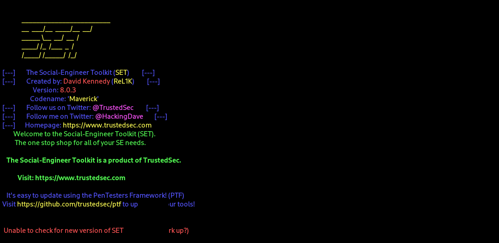
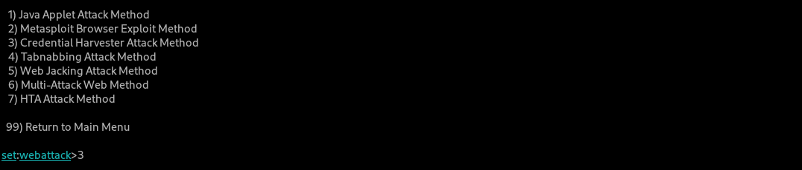
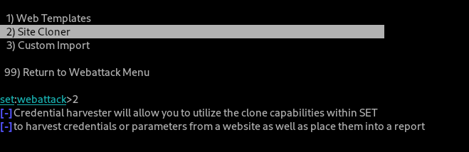
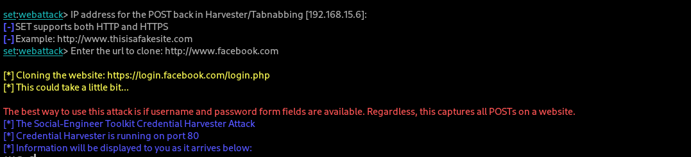
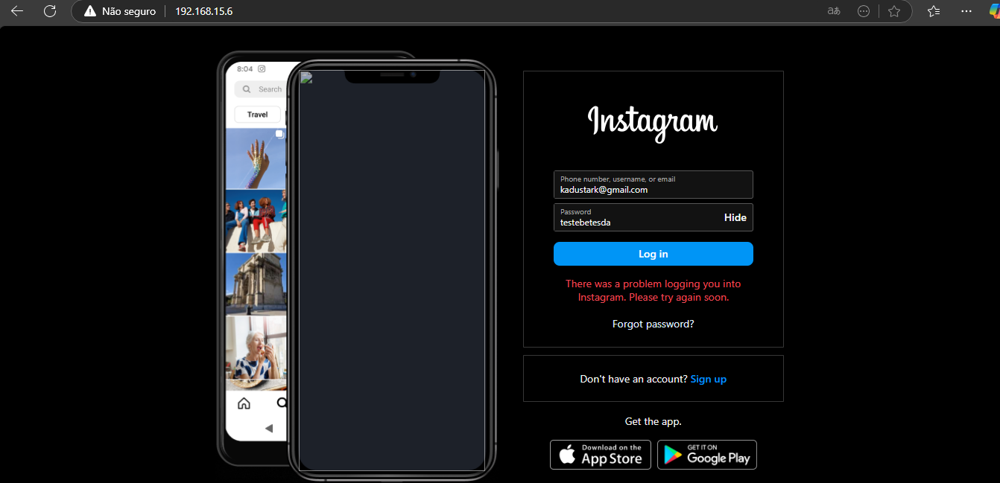
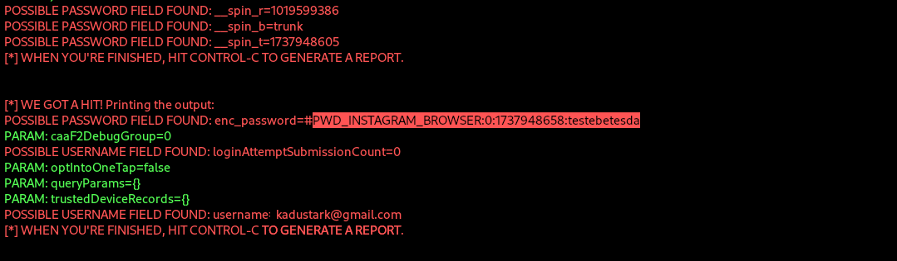

# Phishing para captura de senhas de páginas de login

### Ferramentas

- Kali Linux
- setoolkit

### Configurando o Phishing no Kali Linux

- Acesso root: ``` sudo su ```
- Iniciando o setoolkit: ``` setoolkit ```
- Tipo de ataque: ``` Social-Engineering Attacks ```
- Vetor de ataque: ``` Web Site Attack Vectors ```
- Método de ataque: ```Credential Harvester Attack Method ```
- Método de ataque: ``` Site Cloner ```
- Obtendo o endereço da máquina: ``` ifconfig ```
- URL exemplo para clone: https://www.instagram.com

### Passo a passo:

- 1 - Acesso root


- 2 - acesso a ferramenta setoolkit


- 3 - Social-Engineering Attacks (Op-1)


- 4 - Web Site Attack Vectors (Op-2)


- 5 - Credential Harvester Attack Method (Op-3)


- 6 - Site Cloner (Op-2)


- 7 - Configuração Concluída


- 8.1 - Acesso a Pagina Fake


- 8.2 - Login da Pagina Fake


<i>Obs: Funciona tanto com http quanto para https, entretanto alguns sites possuem proteção contra o clone de sites.</i>